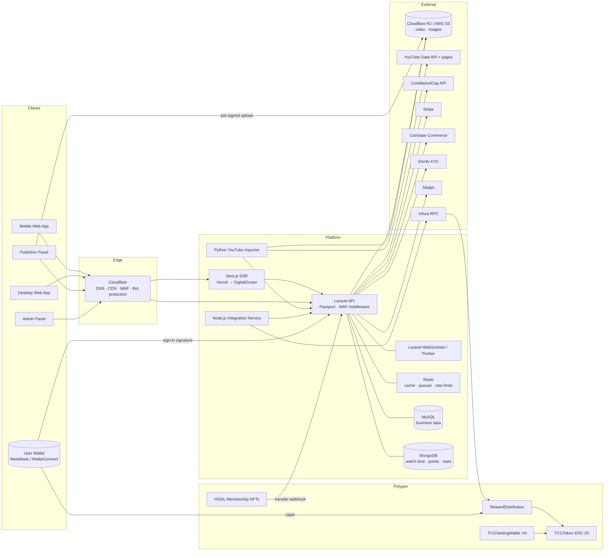
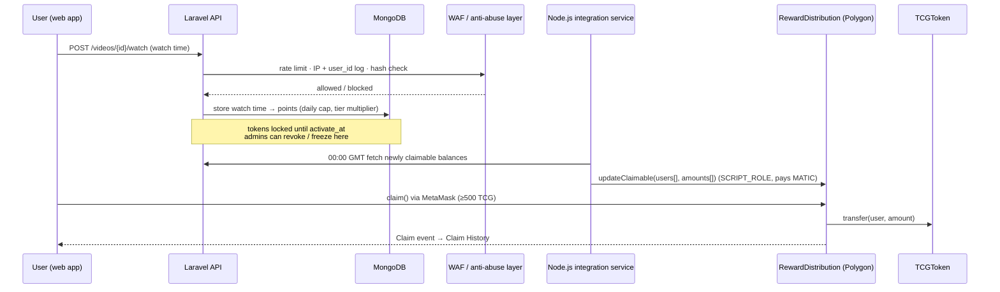

# TodaysCrypto — Full Platform Feature Report

Part of [[Todays Crypto Case Study]]. Related: [[Today's Crypto Story (English)]] · [[Today's Crypto Story (Farsi)]] · [[TodaysCrypto — Website Case Study]]

> [!info] About this report
> **Platform type:** crypto-focused video platform (YouTube-like) with a Web3 token economy
> **Period covered:** November 2020 (rebuild start) to early 2025 (end of engagement)
> **Architecture:** web app · publisher & admin panel · Laravel API · YouTube importer · blockchain integration service · smart contracts on Polygon
>
> **Sources combined:**
> - [[Platform Feature Report]], the code-level analysis of the three main repositories (May 2026). Its full **API endpoint reference** is not repeated here.
> - The `TodaysCrypto/Contracts` repository (Solidity contracts, tests, deployment scripts)
> - Jira tickets, email and chat history with the client (2020–2026)
> - Developer time reports (2022–2023)
> - Product screenshots in `Attachments/TodaysCrypto/ScreenShots`
>
> Anything inferred rather than confirmed in code or writing is marked *(unconfirmed)*.

---

## Table of Contents

1. [Platform Overview](#1-platform-overview)
2. [System Architecture & Technology Stack](#2-system-architecture--technology-stack)
3. [Web App (Viewers)](#3-web-app-viewers)
4. [Publisher Panel](#4-publisher-panel)
5. [Admin Panel](#5-admin-panel)
6. [Backend API — Domain Modules](#6-backend-api--domain-modules)
7. [Web3 & Crypto Layer](#7-web3--crypto-layer)
8. [Monetisation & Business Model](#8-monetisation--business-model)
9. [Content Ingestion — YouTube Importer](#9-content-ingestion--youtube-importer)
10. [Security, Anti-Abuse & Compliance](#10-security-anti-abuse--compliance)
11. [Infrastructure & Operations](#11-infrastructure--operations)
12. [Analytics & Reporting](#12-analytics--reporting)
13. [Delivery Process & Team](#13-delivery-process--team)
14. [Product Timeline](#14-product-timeline)
15. [Known Gaps, Limitations & Discrepancies](#15-known-gaps-limitations--discrepancies)
16. [Glossary](#16-glossary)
17. [Appendix — On-chain Addresses & Screenshots](#17-appendix--on-chain-addresses--screenshots)

---

## 1. Platform Overview

**TodaysCrypto (TC)** is a video and podcast platform built for the cryptocurrency and blockchain community. It combines the core loop of a video platform (upload, watch, subscribe, comment, playlists, recommendations) with crypto-native features:

- live market data next to every video
- Web3 wallet identity
- a native governance token (**TCG**) that users earn by watching and engaging
- NFT-based memberships
- crypto payments
- advertising products for crypto brands

### 1.1 Audiences

| Audience | What the platform gives them |
|---|---|
| **Viewers** | Crypto content with live prices, a personalised feed, and TCG rewards for watching, sharing and inviting |
| **Publishers (creators)** | A studio for uploading or importing from YouTube, analytics, a comment manager, monetisation, referral earnings and payouts |
| **Advertisers / crypto brands** | Banner slots, coin-linked buy buttons and crypto campaigns with click tracking |
| **Token holders** | Claimable TCG, snapshot-based governance, airdrops and StakeDrops, NFT membership boosts |
| **Platform admins** | Full back office: users, content, moderation, earnings, payouts, ads, CRM, token distribution, settings |

### 1.2 Sub-systems

| # | Sub-system | Repository / location | Technology | Role |
|---|---|---|---|---|
| 1 | Web App | `ox-tv-front-next` (Vercel project `tc-front-next`) | Next.js 12 / React 17 | Public viewer experience: mobile web app (MWA) and desktop web app (DWA) |
| 2 | Backend API | `TC-backend` | Laravel 8 / PHP 8 | REST API, business logic, auth, payments, statistics, token accounting |
| 3 | Publisher & Admin Panel | `tc-publisher-panel` | React 17 (CRA + CRACO) | Creator dashboard (PP) and admin back office (AP) |
| 4 | YouTube Importer | Importer service | Python (+ Laravel import API) | Imports and syncs creator channels from YouTube |
| 5 | Blockchain Integration Service | Node.js service | Node.js, ethers/web3, Infura | Pushes settled TCG earnings to the Polygon reward contract daily |
| 6 | Smart Contracts | `TodaysCrypto/Contracts` | Solidity 0.8.9, OpenZeppelin 4.8, Hardhat | TCG token, reward distribution, vesting wallets |
| 7 | Membership NFTs | Separate contracts (not in the Contracts repo) | Polygon NFTs | HODL White / Black membership editions |
| 8 | Legacy | `todayscrypto.com` PHP script (2020) | PHP, no framework | Replaced entirely by the rebuild in December 2020 |

---

## 2. System Architecture & Technology Stack

### 2.1 High-level architecture



### 2.2 Technology stack

**Web App**
- Next.js 12 (SSR + static generation), React 17, Tailwind CSS 2, CSS Modules
- React Query and custom hooks
- Custom HTML5 video player (react-player was evaluated in 2021)
- Web3: wagmi, ethers.js, Web3Modal, MetaMask Jazzicon
- Stripe React SDK, Pusher JS, Chart.js, Swiper, React Slick
- Separate mobile and desktop component trees per page

**Backend API**
- Laravel 8 (PHP 7.3 / 8.0), MySQL (Eloquent), MongoDB, Redis (Predis)
- Laravel Passport (OAuth 2.0) with tokens cached in Redis
- Laravel WebSockets + Pusher
- AWS S3, Cloudflare R2, local disk
- php-ffmpeg (duration), laravel-dompdf (PDF), Maatwebsite/Excel (CSV/XLSX), Intervention Image
- Laravel Cashier (Stripe), Coinbase Commerce
- mantas-done/subtitles, bacon-qr-code (Google 2FA), iDenfy

**Publisher & Admin Panel**
- React 17 (CRA + CRACO), React Router v5, Tailwind, CSS Modules
- React Query, Axios, Video.js with Overlay plugin, Chart.js, Pusher JS, ethers.js

**YouTube Importer**
- Python downloader and metadata pipeline (originally built on `pytube`, later a custom implementation)
- YouTube Data API v3 with a rotating pool of API keys stored in the database
- Import endpoints in the Laravel API; uploads to R2

**Blockchain Integration Service**
- Node.js service (deployed to production in May 2023)
- Talks to Polygon through Infura; signs with the wallet that holds `SCRIPT_ROLE`

**Smart Contracts**
- Solidity 0.8.9, OpenZeppelin Contracts 4.8.2
- Hardhat 2.13 (toolbox 2.0.2, truffle5 plugin), OpenZeppelin test-helpers, web3 1.9, ethereumjs-wallet, eth-sig-util, keccak256
- solhint and prettier
- Optimizer enabled (800 runs)
- Networks: Hardhat local (chainId 1337), Polygon Mumbai testnet, Polygon mainnet; Polygonscan verification

### 2.3 Environments

| Environment | Host / domain | Purpose |
|---|---|---|
| `dev` / `cl-dev` | `dev.todayscrypto.com`, `cl-dev.todayscrypto.com` | Developer integration, API sandbox |
| `beta` | `beta.todayscrypto.com` | Daily integration of new features, founder previews |
| `cl-beta` (closed beta) | `cl-beta.todayscrypto.com` | Closed beta users and client QA (from May 2021) |
| Production | `todayscrypto.com`, `publisher.todayscrypto.com` | Public platform and publisher panel |

### 2.4 Third-party services

| Category | Service | Use |
|---|---|---|
| Hosting | Vercel (2020–2023), Hostinger VPS (2021–2023), DigitalOcean (from May 2023) | Front end, API, importer, beta |
| Edge & storage | Cloudflare (DNS, CDN, WAF, Bot Fight Mode, analytics), Cloudflare R2, AWS S3 | Traffic protection, media storage |
| Monitoring | Pingdom (SolarWinds) | Uptime alerts |
| Email | Mailjet | Transactional email (verification, 2FA codes, notifications) |
| Analytics | Mixpanel (from Sept 2022), Cloudflare Analytics | Product events, traffic |
| Payments | Stripe (Cashier + Checkout), Coinbase Commerce | Card and crypto subscriptions |
| Identity | iDenfy | Publisher KYC |
| Market data | CoinMarketCap API | Prices, ranks, coin detail pages |
| Content | YouTube Data API | Channel and video import |
| Blockchain | Infura, Polygonscan, Gnosis Safe, OpenSea *(listing planned)* | RPC, verification, multisig treasury, NFT marketplace |
| Ads | Google AdSense (planned 2021), HypeLab (evaluated 2024) | Programmatic ads |
| Collaboration | Slack, Jira, Trello, Adobe XD, Loom, BrowserStack, Dropbox | Team process and QA |
| Community | Telegram, X (Twitter) | User support, announcements, airdrops |

---

## 3. Web App (Viewers)

### 3.1 Navigation shell

- **Top bar:** logo, Channels, Membership, TCG Token dropdown (token page, governance, whitepaper, transparency), search, notifications bell, wallet button, Login / Sign-up, Publishers
- **Left sidebar (context-aware):**
  - On content pages: Top / Trending channels with country flags and subscriber counts
  - On market and video pages: a **market sidebar** with cryptocurrency search, tabs for *All / Favourite / Gainers / Losers*, rank, price and 24h change, and a favourite star
- **User menu:** My Profile, TCG Token, Share & Earn, My Custom Feed, Security Settings, Invite Your Friends, HODL Membership, Log out
- **Global UI:** floating 👍/👎 feedback button, market drawer (opened from any coin reference), mini-player, dark design (dark and light logo variants from Oct 2023)

### 3.2 Pages & routes

| Route | Description |
|---|---|
| `/` | Home: trending videos, trending and top channels, latest media, personalised "For You" feed |
| `/channels`, `/channels/[slug]` | Channel directory and channel page |
| `/category/[slug]` | Category listing |
| `/search` | Search results (videos + channels) |
| `/show/[url_hash]` | Video / podcast watch page |
| `/playlists/[url_hash]` | Playlist view |
| `/podcasts` | Podcast listing |
| `/markets/[slug]` | Cryptocurrency detail with historical charts |
| `/tcg` | TCG token page (distribution, balances, claim, earn rules, airdrops) |
| `/governance` | Governance model |
| `/membership`, `/membership-nft` | HODL membership (subscription and NFT editions) |
| `/lottery` | Public lottery listing |
| `/advertisers` | Advertiser information and inquiry form |
| `/about`, `/faq`, `/privacy`, `/tos` | Static pages |
| `/login`, `/register`, `/password`, `/verify` | Auth flows |
| `/m/wallet`, `/m/login-with-wallet`, `/m/register-with-wallet` | Mobile wallet flows |
| `/me/*` | Account area (see 3.7) |
| `/publisher` | Redirect to the publisher panel |
| `/404`, `/403`, `/video404` | Error pages |

### 3.3 Home & discovery

- Trending videos and channels (cached in Redis, refreshed hourly)
- Top channels and latest media (mixed video and podcasts)
- **For You** feed driven by favourite tags and favourite cryptocurrencies
- Category browsing, podcasts-only listing
- Markets page and coin pages with CoinMarketCap data and historical price charts
- Personalised market content: "show content based on my favourite currencies on my market page"
- Verified-channel badge and verified-channel info modal (April 2024)
- New MWA home layout (April 2024)

### 3.4 Video watch page

**Player**
- Custom player UI: play/pause, next, volume, progress, fullscreen, **minimise to mini-player**
- **Tap-to-unmute** for autoplay on mobile
- Intro-video support (branded pre-roll before the main video)
- **Chromecast and AirPlay** casting (2022; later removed on iPhone)
- Chapters navigation and multi-language subtitles
- End-screen card overlays (layers)
- Earn prompt for guests: *"Log in or sign up to earn $TCG tokens for watching this video"*

**Engagement**
- Like / dislike, bookmark, add to playlist, report (with configurable reasons)
- **Share** via native share sheet or custom share modal (X, Facebook, etc.; Reddit dropped in May 2024), generating tracked share links
- **Earn** button explaining TCG rewards for the video
- **Coin ticker** under the video with the cryptocurrencies discussed; each coin opens the market drawer
- Related cryptocurrencies section (hidden on desktop from Sept 2023)
- Related media sidebar with an "EARN 1 TCG" badge and relative publish time

**Comments**
- Nested replies, like/dislike, report, emoji picker
- Pinned comment from the publisher, labelled as the channel
- Mentions
- Subject to mute and forbidden-word rules

**Tracking**
- View counter (rate-limited, hash-validated)
- Watch-time posts for token and monetisation calculations, including guest watch time (June 2024)

### 3.5 Channels

- Header with banner, avatar, subscriber count, description, **social links** (April 2024) and verified badge
- Video listing and channel playlists
- Subscribe / unsubscribe with real-time counter
- Channel statistics (views, subscribers)

### 3.6 Search

- Keyword search across title, description and tags (tags need at least 3 characters)
- Channel results by owner and channel name
- Filters: media type (video / podcast), time period

### 3.7 Account area (`/me`)

| Section | Features |
|---|---|
| **My Profile** | Username, avatar (with crop tool; camera or library upload), bio, ETH address, wallet address, login type |
| **TCG Token** | Distribution progress bar; My / Claimable / Locked TCG; Claim Tokens; Claim History; earn rules; whitepaper and transparency links; airdrop announcements (see §7) |
| **Share & Earn** | Total views and TCG earned from shared links; list of shared videos with share count and views |
| **My Custom Feed** | Favourite tags; favourite cryptocurrencies (limited for free users, unlimited for HODL members); market-page personalisation toggle; 25 TCG reward for completing it |
| **Security Settings** | Change password (separated from profile update in Sept 2022); email 2FA; Google Authenticator (TOTP with QR); account deletion |
| **Invite Your Friends** | Referral link and code, referral statistics, TCG per invite |
| **HODL Membership** | Subscription status, renew/cancel, NFT membership editions and traits, upgrade prompts |
| **Notifications** | Real-time list, mark read / read all (drawer on mobile) |
| **Subscriptions, Bookmarks, Playlists, Feed** | Standard library management |
| **Payments** | Transaction and membership payment history |
| **Delete account** | Soft delete behind 2FA or email verification, restore via token link; data kept 6 months before permanent removal |

### 3.8 Authentication

- Email + password (with image captcha)
- **Magic link** (passwordless)
- **Web3 wallet** login and registration: MetaMask and WalletConnect through Web3Modal, verified by signature
- Email verification with a **6-digit code** (replaced activation links in Aug 2022)
- Password reset by email
- 2FA gate on sensitive operations; login rate limit (2 attempts/minute from the script side, Nov 2023)
- Guest-intent modals: users are asked before being redirected to login when they like, subscribe, save, comment or pay (May 2022)

---

## 4. Publisher Panel

Separate React SPA at `publisher.todayscrypto.com`.

### 4.1 Publisher landing & onboarding

- **Landing pages** (launched Aug 2022, mobile-responsive Oct 2022) covering:
  - Why Today's Crypto
  - Boost value with data (attach coins to content so viewers get live market data)
  - Everything in one place
  - Comment Manager PRO
  - Beautiful dashboard
  - Monetise section: *"reach 500 subscribers and 2,000 watch hours to monetise and earn USDC monthly"*
- **Manual publisher review:** publishers are vetted to prevent cloned channels, copied content and scammers
- Publisher application form, terms acceptance, admin approve/reject with reasons
- Login: email/password, password reset, email verification, magic login links (used to hand accounts to partner channels)
- Mobile visitors are asked to use desktop for publisher sign-up/login (2022)

### 4.2 Navigation

Dashboard · My Media · My Playlists · My Channel · Comments · Monetize · TCG Token · TCG Governance · Invite & Earn · Help. Top bar actions: **Import Media**, **Upload Media**, notifications, settings.

### 4.3 Dashboard

- KPI tiles: **Total Points, Total Watch Hours, Total Subscribers, Total Views, Total Likes, Total Media Published**
- Charts (last 7 / 30 days, monthly): Points, Watch Time (hours), Views, Subscribes vs Unsubscribes, plus further engagement charts
- Per-video and channel statistics: daily, monthly, total

### 4.4 My Media (studio)

- Media table with thumbnail, title, category, playlists, views, comments, likes, status, publish date and actions
- Filters: search, media type, playlist, sort
- **Quick edit** in the list (Aug 2022), bulk delete, bulk pin comment, publish action for imported drafts (`IMPORTED` status)
- **Upload:** direct multipart upload to R2/S3 with pre-signed URLs; automatic duration extraction
- **Studio per video:** title, description, category, tags, language, thumbnail, cryptocurrency associations, chapters, subtitles (multi-language), end-screen layers, publish / unpublish / archive
- Per-video analytics overview

### 4.5 YouTube import (publisher side)

- **Import Media** modal showing the last import timestamp
- **Enable auto import:** automatically import and publish new YouTube uploads
- Import request and sync request, import statistics
- See §9 for the pipeline

### 4.6 Channel management

- Name, avatar, banner, description, social links
- Status (draft / published / frozen), verified status
- Channel-name change request *(link present, route missing; see §15)*

### 4.7 Comment Manager PRO

- Tabs: **All Comments / Remembered Comments / Mentioned Comments**
- Filters: media, time range, sort, page size
- Reply panel with emoji, like/dislike, report, **pin**, **remember** (flag for later), read/unread, mark all replies read
- Comment statistics (total, unread)

### 4.8 Monetize

- Qualification progress rings: **Subscribers x/500** and **Watch Hours x/2000**
- "Invite your audience" call to action, "How it works" explainers
- TCG progress bar towards monetisation
- Earnings list, total earnings, monthly breakdown, qualified-status indicator, payouts, per-month PDF export
- **Low TCG balance warning** prompting publishers to top up TCG "to monetise your content" (March 2024)
- **Cha-Ching** earnings share card for social media (March 2024)

### 4.9 Payment details

- Payout wallet (ETH / Polygon) or other payout address
- Company name and VAT (optional)
- **iDenfy KYC** verification with unique QR code
- Mandatory 6-digit email 2FA (60-second modal) on every save
- Full history of submitted details, kept for audit

### 4.10 Invite & Earn (publisher referral)

- Unique referral link and code
- Total referral sign-ups and total points earned, with charts (sign-ups, earned referral points)
- **+100 monetize points** to the publisher per sign-up; **+500 loyalty points** to the new user
- *Active & Redeem:* activate referral points into monetisation points; monthly view with the current month's referral points (Jan 2023)

### 4.11 TCG Token & TCG Governance

- Token balance: locked vs unlocked, daily watch-limit status
- Governance page (made accessible from the publisher panel in July 2023)

### 4.12 Other

- Notifications (navbar popover), score board / publisher ranking *(built, not routed)*, support tickets *(built, not routed)*, FAQ/Help, profile, account deletion

---

## 5. Admin Panel

### 5.1 Navigation (as built)

Dashboard · Traffic · Videos · Users · Channels · Deleted Channels · CRM · Earnings · Monetization · Payment History · Feedbacks · PoA Requests · Publisher Requests · Messages · Membership plans · Notifications · Lottery · Tags · Reports · Cryptocurrencies · Email's list · Ads manager · Settings

### 5.2 Dashboard

- Totals and this-month figures for:
  - users, channels, videos, videos by minutes and by MB
  - subscribers and unsubscribers
  - views, likes, dislikes, comments
  - reported videos and comments
  - channel points
- Every engagement metric **split between HODL members and non-HODL users** (subscribers, views, likes, dislikes, comments)
- Membership KPIs: total / this-month HODL members, expired members
- Charts: channel subscribers vs unsubscribers (HODL / non-HODL), channel statistics (views / likes / comments), membership earnings, payouts
- **Total platform watch minutes** chart tab (Aug 2023)
- **Traffic** section (Cloudflare analytics integration was proposed Nov 2023) *(unconfirmed scope)*

### 5.3 Users & publishers

- User list with search/filter and full per-user statistics
- Create users and admins; edit, soft-delete, restore
- Mute users (blocks commenting and reacting)
- Remove linked wallet addresses (used against reward abuse)
- Publisher requests: approve / reject with configurable reasons
- **PoA requests** queue *(meaning unconfirmed; likely proof-of-address or publisher-verification requests)*
- Magic-login access to publisher accounts for support and channel onboarding

### 5.4 Channels & videos

- Channel list and details, edit via admin, channel videos, per-channel dashboard and statistics
- Freeze / unfreeze (mutes the owner), delete, deleted-channels archive with restore
- Messaging a channel directly from admin
- YouTube import management: requests, mark completed, update import metadata, add videos by YouTube URL
- Video management: list, create, delete, hide / unhide with reasons, bulk category assignment, **bulk video edit**
- Tag and category management

### 5.5 Moderation & reports

- Reported videos and reported comments with per-item breakdown
- Configurable reason lists: reported video, reported comment, deleted video, hidden video, deleted comment, publisher request
  - e.g. *Fraudulent behaviour, Unwanted advertisement or spam, Hateful or offensive language, Harassment or bullying, Inappropriate username*
- Forbidden-words list
- Feedback inbox with location data

### 5.6 Money

- **Earnings:** all publisher earnings, monthly totals, set total distributed money, trigger calculation, mark paid, CSV export
- **Monetization:** qualified channels, monthly budget, payouts, mark paid, CSV export
- **Payment History:** full transaction ledger, membership subscribers, membership earnings (daily / monthly / total)
- **Payment details:** view, archive, change status, address history
- **Membership plans:** create/edit plans, e.g. *1 Month Hero membership (30 days)* and *1 Year Hero membership (365 days)*; pricing per payment method

### 5.7 CRM

- **Create Customer:** company logo, company name, VAT number, VAT rate, billing address (street, number, postal code, city, country), contact person, contact email and phone, invoicing email
- Companies are linked to ad campaigns

### 5.8 Ads manager

- Sub-menu: **Banner ads campaigns · Banner ads · Buy buttons · Settings**
- **Desktop / Mobile** slot sets. Each slot has upload, preview, redirect URL and status (Draft / Live) with publish/delete:

| Slot | Size (desktop) |
|---|---|
| Home Page Header | 2250 × 200 px |
| Video Page Main | 1500 × 250 px |
| Video Page Related Video | 290 × 250 px |
| Markets Page Header | 2250 × 200 px |

- Campaigns linked to CRM companies; ad tiers, price per slot per date, filled-slot checks, discounts
- **Buy buttons** and crypto campaigns tied to specific coins, with buy-click statistics and export
- Planned banner-manager v2 (July 2023): scheduling, dynamic pricing, schedule-based delivery on the front end, impression and click statistics with charts and exports

### 5.9 Token, lottery, communication

- **TCG dashboard:** total distributed, daily / monthly distribution, per-user token history, TCG circulation-supply setting
- **Lottery:** history, run draw (select winners), mark prize paid
- **Notifications:** broadcast to all users or all publishers, sent history, delete / restore
- **Messages:** support inbox for publishers and HODL members; reply, mark seen, close
- **Email's list:** newsletter subscribers with location data
- **FAQ** and static content management

### 5.10 Settings

- Administrators, all reason lists, security (rate-limit report, suspicious IPs), ad spaces, forbidden words, TCG circulation supply, system logs

---

## 6. Backend API — Domain Modules

Laravel 8 REST API under `/api/*` with role scopes `user`, `publisher`, `admin`. The full endpoint list is in [[Platform Feature Report#7. API Endpoint Reference]].

| Module | Highlights |
|---|---|
| **Auth & identity** | Scoped login; magic links; wallet login/registration with signature verification (message from `/wallet/get-message`, Keccak-256 recovery); Passport tokens cached in Redis; email and Google 2FA with `2fa` / `2fa:hard` middleware; 6-digit email verification; captcha; iDenfy verification URL and webhook |
| **Video** | `video` / `podcast` types; statuses `draft`, `draft_yi` (YouTube import), `published`, `archived`, `suspended`, `hidden`; pre-signed S3/R2 uploads; ffmpeg duration; 12-character URL hash; views and watch time; share links; related media |
| **Video metadata** | Chapters, subtitles (multi-format), end-screen layers, key/value meta |
| **Channels** | One per publisher, auto-created; `draft` / `published` / `freeze`; statistics; YouTube import lifecycle; auto-import toggle |
| **Comments** | Replies, reactions, pin, report, publisher inbox, remember, read state, mentions |
| **Playlists** | Single and bulk operations, public playlists |
| **Notifications** | Scoped real-time notifications, broadcast, soft delete / restore, observer-based notification manager (refactored May 2022) |
| **Real-time events** | `VideoCreated/Updated/Deleted/Viewed/Watched/Liked/Commented`, `ChannelSubscribed/Updated`, import-request lifecycle, publisher-request lifecycle, messages, `UserVerified`, `Market` |
| **Statistics** | MongoDB-backed daily / monthly / total stats for videos, channels, platform watch minutes |
| **Monetisation** | Qualified status, monthly budget distribution, earnings calculation, payouts, PDF/CSV |
| **Payments** | Stripe setup intent, subscriptions and Checkout; Coinbase Commerce checkout and webhook; plans, pricing, transactions |
| **Membership** | Hero / HODL subscriptions, gifted memberships, NFT membership webhook (`/tc-polygon/update-hero-data`) |
| **Referral** | Codes, availability check, points, activation, statistics |
| **TCG accounting** | Watch-time points, daily caps, locked tokens with `activate_at`, history, claimable export for the integration service, admin revocation and freezing |
| **Crypto & market** | Listings, historical prices, favourites, crypto campaigns, buy-click tracking |
| **Ads** | Campaigns, companies, tiers, slots, prices, discounts, settings, ad spaces |
| **Lottery, support, CMS** | Draws, tickets, static pages, FAQ, feedback, mail list, forbidden words, reasons |
| **Security** | WAF rate limiting, suspicious-IP blocking, hash validation, user_id + IP request logging, registration IP limits |
| **Forms** | Global form structure (contact-us and others) with admin listing (Aug 2022) |

---

## 7. Web3 & Crypto Layer

### 7.1 Wallet identity

| Feature | Details |
|---|---|
| Wallets supported | MetaMask (injected), WalletConnect; connection via Web3Modal + wagmi |
| Login with wallet | Backend issues a message → wallet signs → API recovers signer (Keccak-256) → issues a Passport token |
| Register with wallet | Account created from the wallet address alone; email optional |
| Linked addresses | Profile stores ETH address and connected wallet; publishers store a payout wallet behind KYC and 2FA |
| Mobile flows | Dedicated `/m/wallet`, `/m/login-with-wallet`, `/m/register-with-wallet` pages |
| Rules | Wallet-connect options greyed out where unsupported (desktop, June 2023); login attempts rate-limited |

### 7.2 TCG tokenomics (as implemented)

| Item | Value / rule |
|---|---|
| Token | **TodaysCrypto (TCG)**, ERC-20 on **Polygon mainnet**, 18 decimals |
| On-chain supply | **5,000,000,000 TCG**, minted once; no mint, no burn |
| Token sale | None. *"Fairness between users is crucial … a token sale won't occur. TCGs are for those that use the platform."* |
| Earn: watching | **1 TCG per minute watched** (free users), capped daily |
| Earn: custom feed | **25 TCG** for setting up a custom feed |
| Earn: invite a friend | **5 TCG** per invited user (viewer referral) |
| Earn: publisher referral | +100 monetize points per sign-up; +500 loyalty points to the new user |
| Earn: share & earn | TCG for views generated by a user's share links |
| Earn: engagement | Liked-comment rewards (restricted in 2023 after abuse, e.g. limits on liking the same user's comments within 24h) |
| HODL White boost | 1–3 TCG/min, up to **180 TCG/day** (60 min/day) |
| HODL Black boost | 5–15 TCG/min, up to **900 TCG/day** (60 min/day) |
| Locking | Earned tokens are **locked** until their `activate_at` date, then become **claimable** |
| Claim threshold | Minimum **500 TCG** earned before claiming |
| Settlement cadence | Claimable balances pushed on-chain once daily at **00:00 GMT** |
| Gas | Users pay gas for `claim()`; the platform pays MATIC for daily `updateClaimable` batches |
| Yearly plan bonus | **5,000 TCG** included with the yearly membership (May 2023) |
| Circulation display | Admin-set "TCG circulation supply" shown publicly (`/options/tcg-circulation-supply`) |

### 7.3 Smart contracts — specification

Repository: `git@github.com:TodaysCrypto/Contracts.git` (single initial commit, 4 May 2023). License MIT.

```
contracts/
  TCGToken.sol
  RewardDistribution.sol
  TCGVestingWallet.sol
  interfaces/ITCGToken.sol
scripts/
  001-deploy-tcg-token.js
  002-deploy-reward-distribution.js
  003-create-vesting-wallets.js
test/
  TCGToken.test.js · TCGTokenSnapshot.test.js · TCGTokenVotes.test.js
  RewardDistribution.test.js · TCGVestingWallet.test.js
  ERC20.behavior.js · VestingWallet.behavior.js · helpers/
```

#### 7.3.1 `TCGToken`

`contract TCGToken is ERC20, ERC20Snapshot, Ownable, ERC20Permit, ERC20Votes`

| Aspect | Specification |
|---|---|
| Name / symbol | `"TodaysCrypto"` / `"TCG"` |
| Decimals | 18 |
| Constructor | `constructor(address distributor)`: reverts if `distributor == address(0)`; mints `5,000,000,000 × 10^18` to `distributor` |
| Supply policy | Fixed. No public mint; `_burn` overridden with an empty body so no burn path exists (tests assert mint, burn and burnFrom fail) |
| Snapshots | `snapshot()` (onlyOwner) → `balanceOfAt(account, id)`, `totalSupplyAt(id)` for governance voting power and airdrop eligibility |
| Voting | ERC20Votes: `delegate`, `delegateBySig`, `delegates`, `getVotes`, `getPastVotes`, `getPastTotalSupply`, `checkpoints`, `numCheckpoints` |
| Permit | EIP-2612: `permit`, `nonces`, `DOMAIN_SEPARATOR` (gasless approvals by signature, domain name "TodaysCrypto") |
| Ownership | `Ownable`: `owner`, `transferOwnership`, `renounceOwnership`; the owner can only take snapshots |
| Upgradeability | **None, by design.** A non-upgradeable version was redeployed to Mumbai in April 2023 before mainnet |
| Integration interface | `ITCGToken` (IERC20 + IERC20Permit + ownable, snapshot and votes functions) |

#### 7.3.2 `RewardDistribution`

`contract RewardDistribution is AccessControl`

| Aspect | Specification |
|---|---|
| State | `IERC20 public token`; `mapping(address => uint256) public claimable` |
| Roles | `DEFAULT_ADMIN_ROLE` (deployer); `SCRIPT_ROLE = keccak256("SCRIPT_ROLE")` (backend integration wallet, granted by admin) |
| `updateClaimable(address[] users, uint256[] amounts)` | `onlyScriptRole`. Arrays must match length; **adds** each amount to `claimable[user]` (incremental ledger) |
| `claim()` | Any user. Reverts `"Nothing to claim"` if zero; sets `claimable[msg.sender] = 0`, emits `Claim`, then transfers (checks-effects-interactions) |
| `recoverTokens(tokenAddress, recipient, amount)` | `onlyAdmin`. Recovers **other** ERC-20s sent by mistake; reverts if `tokenAddress == token` so the TCG reward pool can't be withdrawn by the admin |
| Events | `Claim(address indexed user, uint256 amount)`; `TokensRecovered(address indexed tokenAddress, address indexed recipient, uint256 amount)` |
| Funding | TCG transferred into the contract from the distributor / treasury |
| Design note | A Merkle-tree claim model was specified first (April 2023); the shipped design is an on-chain ledger with daily batched updates (see 7.4) |

#### 7.3.3 `TCGVestingWallet`

`contract TCGVestingWallet is VestingWallet` (OpenZeppelin)

| Aspect | Specification |
|---|---|
| Constructor | `(address beneficiary, uint64 startTimestamp, uint64 durationSeconds)` |
| Schedule | Linear vesting from `start` to `start + duration`, no cliff |
| Functions | `beneficiary`, `start`, `duration`, `released(token)`, `releasable(token)`, `vestedAmount(token, timestamp)`, `release(token)` (ERC-20 and native) |
| Deployment | `003-create-vesting-wallets.js` deploys one wallet per allocation: **8 allocations** in the committed config, start `1682380799` (24 Apr 2023 23:59:59 UTC). The committed duration (864,000 s = 10 days) and empty beneficiary addresses are placeholders; production values were set at deploy time *(unconfirmed)* |

#### 7.3.4 Build, test & deploy

| Area | Details |
|---|---|
| Compiler | Solidity 0.8.9, optimizer on, 800 runs |
| Networks | `hardhat` (chainId 1337), `mumbai` (Infura, 35 gwei gas price), `polygon` (Infura) |
| Config / secrets | `.env`: `INFURA_API_KEY`, `POLYGONSCAN_API_KEY`, `PRIVATE_KEY`, `DISTRIBUTOR` |
| Deploy order | 1) token → write `deploy.json` · 2) RewardDistribution(token) → append address · 3) vesting wallets |
| Verification | Source verified on Polygonscan / Mumbai Polygonscan |
| Tests | OpenZeppelin behaviour suites for ERC-20 (allowances, transfers), snapshots, votes and vesting; plus custom tests: name/symbol/decimals, mint/burn/burnFrom must fail, `SCRIPT_ROLE` gating, array-length check, claim correctness |
| Quality tooling | `solhint` rules, `prettier` / `lint:prettier` scripts |
| Treasury | **Gnosis Safe multisigs** for company wallets (April 2023) |
| Project tracking | Jira project **"TCG – Integration"**: testnet deploy, reward distribution design, multisigs, token distribution diagram (May 2023) |

### 7.4 Earn → claim pipeline



**Why this shape:**
- **Off-chain earning** keeps watching fast and free; only ownership transfers touch the chain.
- **Daily batching** gives a human **control point** between earned and claimable. It was used to halt distribution during the November 2023 bot attack.
- **Pull claims** mean users pay their own claim gas, and the contract never pushes tokens to unverified addresses.

**Operational controls:**
- Nightly update can be disabled (kill switch in code)
- Manual trigger for a catch-up run *(used with caution; an earlier manual run caused duplicates)*
- Top-up alerts for the MATIC gas balance *(a missing top-up stalled claims in Nov 2023)*
- Infura daily request quota *(hit in Aug 2024)*

### 7.5 HODL membership (subscription → NFT)

| Generation | Model |
|---|---|
| **Hero membership** (2021–2023) | Stripe / Coinbase subscriptions: 1-month (30 days) and 1-year (365 days) plans; gifted memberships; simplified to **$5/month or $50/year** with 5,000 TCG on yearly (May 2023) |
| **HODL membership** (2023) | Rebrand; promotional memberships for referral sign-ups shortened to **7 days** to curb multi-accounting (Nov 2023) |
| **HODL NFT membership** (Jan 2024) | Mint and hold the NFT in the connected wallet; **sell or transfer** the membership freely |

| NFT edition | Price | Supply cap | Earning boost | Perks |
|---|---|---|---|---|
| **White** | 50 MATIC | 100,000 | 1–3 TCG/min, up to 180/day | Unlimited token/coin tracking, partly ad-free, influence on creator earnings, HODL profile badge |
| **Black** | 250 MATIC | 20,000 | 5–15 TCG/min, up to 900/day | Unlimited tracking, completely ad-free, influence on creator earnings, HODL badge, future extras |

- **Revenue split (stated on page):** 50% of all membership sales plus 50% of creator earnings go to the creator monetisation engine
- **On-chain sync:** an NFT transfer webhook updates the holder's membership status in the platform automatically
- **Membership page:** `/membership-nft` with edition cards, traits modal, animated previews; OpenSea details planned

### 7.6 Governance & transparency

- **Governance page:** *"the first-ever content governance"*
  - TCG holders vote on content quality and platform proposals
  - Voting power = TCG held on the platform plus in the connected wallet
- **Snapshot on-chain voting:** a snapshot before every proposal, timing not announced in advance; all voting on-chain (supported by `ERC20Snapshot` and `ERC20Votes`)
- **Revenue sharing:** **10% of platform revenue** to a *Governance Reward Pool* paid to voters in stablecoins (USDT), proportional to voting power
- **Transparency tab** on the TCG page (May 2023): links to all contract and wallet addresses on Polygonscan
- Whitepaper link; TCG Governance entry in the publisher panel
- *Status:* the governance model and token primitives shipped; a proposal/voting UI is not present in the analysed code *(see §15)*

### 7.7 Airdrops & StakeDrop

| Campaign | Mechanics |
|---|---|
| **Community airdrop #1** (Nov 2023) | Sign-up and engagement campaign before the exchange listing / IEO; 2,000+ sign-ups on day one |
| **Launchpad push** (Nov 2023) | Follow-up campaign during the exchange listing process |
| **StakeDrop, airdrop #3** *(likely Feb–Jul 2024)* | Monthly snapshot on the 1st; holders with **≥5,000 TCG** receive **2% of holdings monthly (≈27% APY)** to the same wallet; six months from 1 Feb to 1 Jul; no cap |
| In-app | "Active Airdrop" modal on the TCG page; *"We will never ask you to invest or share any wallet details!"* safety notice; announcements via X |

### 7.8 Crypto payments

- **Coinbase Commerce:** crypto checkout for memberships with webhook confirmation; direct-to-checkout flow (LIAG-343, May 2023)
- **Stripe:** card subscriptions and Checkout (production May 2023)
- **MATIC:** NFT membership mint price
- **USDC / USDT:** publisher monetisation payouts (USDC monthly) and governance rewards (USDT)

### 7.9 Market data & crypto campaigns

- CoinMarketCap-powered listings: rank, price, 24h change, gainers / losers, favourites
- Coin detail pages with historical prices
- Coin ticker and market drawer on video pages; publishers attach cryptocurrencies to each video (the importer can suggest them)
- Real-time `Market` events; server-side market-data service (update interval tuned from 5s to 20s after a CPU incident)
- Crypto campaigns: link coins to campaigns and **buy buttons**, track buy clicks, export statistics
- Delisting of junk or duplicate coins that break layouts (Aug 2023)

### 7.10 Exchange & ecosystem work (company side, supported by engineering)

- Listing work with smaller exchanges and launchpads (Sept–Nov 2023), including talks with LBANK; IEO announcement Nov 2023
- Transparency data and contract addresses prepared for exchange due diligence
- Community tooling: Telegram group moderation support, a script to export Telegram chats with usernames and shared wallet addresses (Nov 2023)

---

## 8. Monetisation & Business Model

| Revenue / value stream | Mechanism |
|---|---|
| Memberships | Hero/HODL subscriptions (Stripe, Coinbase), HODL NFT mint sales (MATIC) |
| Advertising | Banner slots (desktop/mobile), buy buttons, crypto campaigns, CRM-backed invoicing; AdSense (planned), HypeLab (evaluated) |
| Creator monetisation | Qualification at **500 subscribers + 2,000 watch hours**; monthly budget distributed among qualified channels; **USDC monthly** payouts; 50% of membership sales + 50% of creator earnings fund the engine |
| Token utility | Watch-to-earn, boosts via NFTs, governance rights, StakeDrops, TCG balance requirement for publisher monetisation (2024) |
| Growth loops | Viewer referrals (5 TCG), publisher referrals (100 monetize points / 500 loyalty points), Share & Earn, Cha-Ching sharing, custom feed reward |
| Engagement | Lottery draws linked to the points system |
| New monetisation model (mid-2024) | Reworked referral and monetisation structure (in progress at end of engagement) *(details unconfirmed)* |

---

## 9. Content Ingestion — YouTube Importer

### 9.1 Purpose

Remove the biggest onboarding barrier: established creators won't re-upload their libraries. The importer copies a channel's back catalogue and keeps new uploads in sync.

### 9.2 Features

| Feature | Details |
|---|---|
| Channel import | Full back catalogue: videos, titles, **full descriptions**, thumbnails, tags, chapters (chapter script, Sept 2022) |
| Auto import / sync | Scheduled checks of all channels every **2 hours**; new uploads imported and auto-published when enabled |
| Publisher controls | Import request, sync request, auto-import toggle, last import time, import stats |
| Admin controls | Import requests queue, mark completed, update import metadata, add a single video by URL, set up partner channels with credentials and magic-login handover |
| Draft handling | Imported media arrive as `draft_yi` / "Imported" for review, or are published directly |
| Storage | Video files uploaded to Cloudflare R2 |
| Crypto tagging | Related cryptocurrencies attached during import, with admin overrides and delisting |
| Timestamps | Publish time set to import time (Sept 2023) so feeds reflect freshness |
| Resilience | Retry on failed downloads; API-key pool with reset and rotation; **auto-restart** when quotas are exceeded (Aug 2023); service watchdog |
| Queue | One channel at a time (large new channels, e.g. 320 videos, delay others until done) |
| Isolation | Moved off the production API server to its own VPS (Feb 2023), later to DigitalOcean |
| Monitoring | Importer status API for an admin dashboard; alert on "no new video for a while" (requested 2023) |

### 9.3 Evolution

| Date | Change |
|---|---|
| 2021 | First tool, built by an external contractor on a fixed budget |
| Jun–Sep 2022 | Rebuilt scraper: API-key support, full descriptions, video file download, retries, thumbnails, new downloader |
| Sep 2022 | First partner channel imported (~100 videos overnight) |
| Feb–Mar 2023 | API-key rotation; fix after `pytube` broke on YouTube's format change |
| Jul–Aug 2023 | Fixes for YouTube HTML changes; auto-restart on quota exhaustion; R2 credential incident |
| Sep 2023 | **New method** with metadata and files both in Python and far fewer API calls; weeks of stable operation |
| 2024 | Increasing YouTube anti-download measures; proxy and client-emulation attempts; long outages by late 2024 |

### 9.4 Onboarded channels (examples)

CoinGecko, CoinDesk, OKX, Conor Kenny, Digital Asset News, Thinking Crypto (~150 videos), Common Sense Crypto (~150 videos), Crypto Geek, Natoshi, Girl Gone Crypto, Crypto Crow, Ncash, Savvy Financial, and more. The channel directory also lists Bybit, CryptoCoinShow, CryptoWendyO, Whiteboard Crypto, Tom Crown, Cryptonauts, DHN Crypto, Hayden Otto, Crypto Lifer.

---

## 10. Security, Anti-Abuse & Compliance

### 10.1 Account security

- Passwords with reset tokens (single use; a server-config bug allowing reuse was fixed in Nov 2021)
- Email 2FA and Google Authenticator TOTP; hard-2FA middleware on sensitive mutations
- 6-digit email verification; magic links; wallet signature login
- Image captcha on auth forms
- Login rate limit (2/minute) and registration limits per IP
- Soft-delete with 6-month retention; restore tokens; 2FA-gated deletion

### 10.2 Platform protection

| Layer | Controls |
|---|---|
| Edge | Cloudflare proxy, Bot Fight Mode / bot detection (automated traffic alerts from Feb 2023), rate limiting, IP blocking |
| API WAF | `waf.ratelimit`, `waf.validate-hash`, suspicious-IP tracking, bad-request logging, security rate-limit report in admin |
| Request forensics | Security layer logging **user_id + IP** on earning endpoints (Nov 2023) |
| Registration | IP-based sign-up limits (spec: 2 registrations per IP per 14 days, IP retained 14 days), generic error message that doesn't reveal the rule; IP stored at sign-up |
| Content | Mute (user and channel), channel freeze, hide/unhide, reports, forbidden words, manual publisher vetting |
| Payments | Webhook verification for Coinbase, iDenfy and the NFT listener; Stripe-hosted card handling |

### 10.3 Token-economy anti-abuse (Web3-specific)

**Threats observed:**
- Multi-account farming
- Referral rings (one referrer with ~10,000 referrals)
- Bot watch-time submissions (one account: 2,000 writes/day, 379k seconds)
- Liked-comment farming
- Temporary-email sign-ups
- Consolidating tokens claimed from many accounts into one wallet (>1.3M TCG, ~10% of all claimed at the time)

**Controls built:**
1. **Distribution kill switch:** skip the nightly `updateClaimable` while investigating
2. **Off-chain revocation / freeze** of earned tokens before they become claimable; removal of wallets from flagged accounts
3. **IP-cluster blocking:** in one day ~260,000 watch-time writes from ~340 IPs across ~1,270 accounts were blocked automatically
4. **Pattern detection:** same referrer + same IP group + near-identical watch time → suspicious (e.g. 6 accounts / 3 IPs)
5. **Disposable-email purge:** ~80 accounts plus their referrers disabled
6. **Reward design changes:** daily caps, restrictions on liked-comment rewards, 7-day promotional memberships, 500 TCG claim threshold, locked-until-activation period
7. **Proposed:** on-chain alerting for accounts whose wallets all forward tokens to the same address

**Lesson encoded in the design:** anything already written on-chain is final; every control must act **before** the daily settlement.

### 10.4 Compliance

- iDenfy KYC for publisher payouts, with a full audit log of payment-detail changes
- VAT-aware CRM and invoicing for advertisers
- Privacy policy and terms pages
- Data retention: soft deletes kept 6 months

---

## 11. Infrastructure & Operations

### 11.1 Hosting history

| Period | Setup |
|---|---|
| Nov 2020 | Inherited VPS running the legacy PHP script (Apache) behind Cloudflare |
| Dec 2020 – 2022 | Next.js on Vercel (and a self-hosted fallback); Laravel API on VPS |
| 2021 – May 2023 | Hostinger VPS for API, beta and importer (datacenter moved to a US node at one point) |
| Jan 2023 | Server migration (followed by a disk-full incident) |
| Feb 2023 | Separate VPS for importer + beta API; production API isolated |
| **May 2023** | **Migration to DigitalOcean** (front end + API); Cloudflare protection re-tuned |
| Sept 2023 | Remaining services moved off Hostinger (Jira LIAG-393) |
| Nov 2023 | Vertical scaling under airdrop load; query profiling; SSR temporarily disabled |

### 11.2 Monitoring & tooling

- **Pingdom** uptime alerts to engineering and the founder
- **Cloudflare analytics** for traffic and bot share (e.g. baseline ~41% automated; a spike of +132% in Feb 2023)
- Server logs, MySQL query logging (when needed), MongoDB restart-on-failure policy
- Scheduled log cleanup jobs
- Incident log and **server migration checklist** (from Jan 2023)

### 11.3 Incident register (selected)

| Date | Incident | Root cause | Fix / follow-up |
|---|---|---|---|
| Mar 2022 | Site-wide client errors, testers logged out | Last-minute front-end change | Reverted / patched same night |
| Nov 2022 | Platform down | Hosting provider | Restored; security review |
| Dec 2022 | Sign-up failing during a promotion | Email-verification fix never deployed to production | Hotfix deploy; manual verification; deployment checks |
| Jan 2023 | 1.5h outage | MySQL query logs filled the disk after migration | Log cleanup cron, incident log, migration checklist |
| Feb 2023 | Repeated DB / API downtime | CPU overload from 5-second price updates; importer failure on the production server | 20-second interval; importer and beta moved to a separate server |
| Feb–Apr 2023 | Frequent up/down, including a full-night outage | Hosting datacenter degradation + app load | Migration to DigitalOcean (May 2023) |
| May 2023 | Videos showing 00:00 duration | Duration not computed on the new server | Recalculated all durations; fixed pipeline |
| May 2023 | Next.js memory limits | Oversized API payloads on home page | Payload clean-up and optimisation |
| Aug 2023 | Importer down for days | R2 bucket credentials removed | Buckets reconfigured, new credentials |
| Nov 2023 | Outages under airdrop traffic | Load + bot traffic | Resized servers, bot blocking, SSR off, query optimisation |
| Nov 2023 | Disk full | Market-data service wrote 59 GB of logs | Service disabled, logging fixed |
| Nov 2023 | Claims stalled | Integration service not restarted after resize; MATIC gas exhausted | Service restart, manual run, wallet top-up |
| Nov 2023 | "Tokens disappeared" | Failed on-chain transaction; reward-limit change applied before settlement | Logs traced; balances restored next morning |
| May 2024 | Up/down | Watch-time conversion script (4M records) consuming resources | Script paused, conversion rescheduled |
| Aug 2024 | Claim update errors | Infura daily request limit | Investigated quota / plan |
| Late 2024 | Long importer outage | YouTube anti-download measures | Proxy and client-emulation attempts; restructure proposed |

---

## 12. Analytics & Reporting

| Area | Capability |
|---|---|
| Admin dashboard | Platform totals and monthly figures, all engagement split **HODL vs non-HODL**, membership and payout charts, platform watch minutes |
| Publisher dashboard | Points, watch hours, subscribers, views, likes, media published; 30-day charts |
| Statistics engine | MongoDB-backed daily / monthly / total for videos and channels; stats DB migrated between servers in Jan 2023 |
| Token analytics | Distributed totals, daily / monthly distribution, per-user history, claim history, on-chain verification via Polygonscan |
| Campaigns | Buy-click and campaign statistics with exports |
| Product analytics | Mixpanel events (Sept 2022) |
| Traffic | Cloudflare analytics (e.g. **10.77K unique visitors/day** during the Nov 2023 airdrop) |
| Exports | Earnings PDF (publisher), earnings and payouts CSV (admin), campaign statistics |
| Feedback | In-app feedback with location data |

---

## 13. Delivery Process & Team

### 13.1 Team

| Side | Roles |
|---|---|
| Engineering (core) | CTO / lead full-stack engineer; frontend engineer (web app); backend engineer (API, data, importer support); frontend engineer (publisher & admin panels) |
| Engineering (extended) | Smart-contract engineer (TCG integration, 2023); UI developer (2024); external contractor (importer v1, 2021) |
| Client | Founder / CEO (product owner, design direction); product & QA owner; partnerships lead (creator channels, exchanges) |

### 13.2 Process & tools

| Practice | Implementation |
|---|---|
| Communication | Skype (2020–21) → Slack; fixed-time syncs (10:00 CET); WhatsApp for urgent issues; Loom walkthroughs |
| Planning | Trello (from Jul 2021) → Jira projects: **Todays Crypto 1.0 (TC10)**, **Learn, Improve and Grow (LIAG)**, **TCG – Integration (TCG)** |
| Workflow | *Backlog → Selected for Development → In Progress → Business QA → QA Done / Ready for Prod → Deployed / Done*; client-run QA before release |
| Sprints | Sprint planning with the client; CTO breaks issues into child tasks, estimates with the team, briefs developers |
| Design | Adobe XD files (e.g. TC-MWA, desktop landing page) shared by the founder |
| QA | Founder and QA owner test on real devices; BrowserStack for iOS/Android matrix |
| Code quality | Peer code review; small tasks; time logged per Jira issue |
| Transparency | Daily per-developer time reports in a shared workbook (from May 2022); monthly invoices matching the reports |
| Environments | beta → cl-beta → production promotion |

---

## 14. Product Timeline

| Date | Milestone |
|---|---|
| 12 Nov 2020 | First meeting; access to legacy repo, server and Cloudflare |
| Nov–Dec 2020 | Code review of legacy PHP script → decision to rebuild |
| 30 Dec 2020 | First deployed version of the new platform (home, category, video, channel pages; subscribe, likes, bookmarks) |
| Jan 2021 | Sign-up / login; first additional engineer joins |
| Feb–Apr 2021 | Mobile web app, logo, video player, share, pinned comments, intro videos |
| 3 May 2021 | Branded verification emails |
| **9 May 2021** | **Closed beta live (`cl-beta`)** |
| May–Jun 2021 | Performance restructure, tap-to-unmute, coin ticker, market drawer, Stripe |
| Jun–Jul 2021 | Notifications, chapters, minimise player, coin pages (CoinMarketCap); team of four; Trello |
| Late 2021 | Profile tags, crop tool, S3 image uploads, publisher login redesign |
| 2022 H1 | Guest-intent modals, notification manager refactor, casting, comment manager, 2FA, captcha, MongoDB stats |
| Jul–Aug 2022 | iDenfy KYC, 6-digit email verification, global forms, R2 uploads, **public landing pages** |
| Sep 2022 | YouTube importer; first partner channels; Mixpanel; budget reduction |
| Oct 2022 | CoinGecko channel; publisher landing responsive |
| **Dec 2022** | **Desktop web app launched**; ad uploader (banner slots) |
| Jan 2023 | Hero flow on desktop, referral UI in publisher panel, server migration |
| Feb–Mar 2023 | Production/importer server split; token page for users (DWA & MWA) |
| **Apr 2023** | **TCG contracts:** Mumbai testnet deployment (non-upgradeable), Merkle design review, Gnosis Safe multisigs |
| May 2023 | Contracts repo committed; token distribution diagram; **DigitalOcean migration**; Node.js integration service, Stripe Checkout and TCG transparency tab in production; Coinbase direct checkout |
| Jun 2023 | OKX channel |
| Jul 2023 | TCG points system changes; **claims live**; governance page; banner manager v2 scoped |
| Aug 2023 | IP registration limits, platform watch-minutes chart, anti-abuse on comment rewards, importer auto-restart |
| Sep 2023 | New importer method; import-time timestamps; exchange discussions |
| Oct 2023 | Brand refresh (dark/light logo, X icon); pre-IEO UI push |
| **Nov 2023** | **First community airdrop** (2,000+ sign-ups day one); scaling; bot-farm defence; 7-day promo memberships |
| **Jan 2024** | **HODL NFT membership page**; data restoration for claim thresholds |
| Feb 2024 | StakeDrop (airdrop #3) starts *(likely)* |
| Mar 2024 | Low TCG balance warning, Cha-Ching sharing |
| Apr 2024 | Verified channel modal, channel social icons, new MWA home |
| May 2024 | Share & Earn, subscriber button update, referral restructure |
| Jun 2024 | Guest watch-time storage; new monetisation model work |
| Late 2024 | Importer blocked by YouTube; restructuring explored |
| Early 2025 | Engagement winds down |
| Nov–Dec 2025 | Monitoring access removed; remaining servers shut down |

---

## 15. Known Gaps, Limitations & Discrepancies

### 15.1 From the code analysis

| Item | Status |
|---|---|
| `/membership/membership` (web app) | Disabled stub (returns `null`) |
| `/me/messages` | Route missing; old messages flow redirects there |
| Podcasts page | Requires authentication; guests hit `/403` |
| Publisher score board | Built, not routed |
| Publisher support ticketing page | Built, not routed (only FAQ at `/publisher/faq`) |
| Publisher full notifications page | Not routed (navbar popover only) |
| Channel-name change request | Linked route does not exist |
| Live streaming | Not implemented |
| Shorts / vertical format | Not implemented (`video` and `podcast` only) |
| i18n | UI English-only; subtitles multi-language |

### 15.2 Web3-specific findings

| # | Finding | Impact / note |
|---|---|---|
| 1 | **Supply mismatch:** contract mints **5,000,000,000 TCG**; [[Platform Feature Report]] §4.13 lists **3,500,000,000** | Probably a distribution-pool or circulation figure in the backend; align before publishing any tokenomics |
| 2 | `updateClaimable` is **additive** | A repeated or manual batch double-credits users. Needs idempotency (e.g. per-day batch IDs) or set-based updates |
| 3 | No `pause` in `RewardDistribution` | Emergency stop depends entirely on the off-chain service not submitting; users can still claim anything already written |
| 4 | No admin withdrawal of TCG from the reward contract | By design (trust), but over-funded TCG is locked unless distributed |
| 5 | Snapshot and votes are on-chain, but **no proposal/voting UI or governor contract** in the analysed code | Governance described on the page; execution layer not built |
| 6 | Vesting script contains **placeholder beneficiaries and a 10-day duration** | Production allocation parameters are not recorded in the repo |
| 7 | **HODL NFT contracts not in the Contracts repo** | Source, royalties and mint logic undocumented in version control |
| 8 | Merkle-tree claims specified, not shipped | Higher recurring gas cost for daily batches, paid in MATIC |
| 9 | Hardhat config declares `solidity` twice | Harmless (the second, optimised block wins) |
| 10 | Single operational key holder for `SCRIPT_ROLE` wallet and gas top-ups | Operational single point of failure (MATIC exhaustion, Nov 2023) |
| 11 | Repo history is a single squashed commit | Development history of the contracts isn't preserved |

### 15.3 Platform & operational limitations

- **YouTube dependency:** the content pipeline relies on downloading from a platform that actively blocks it
- **Single-operator risk:** deployments, server access and importer fixes concentrated in one engineer; no formal on-call
- **Late alerting:** importer failure alerts requested Feb 2023, auto-restart Aug 2023
- **Anti-abuse was reactive:** IP, cluster and cap controls were mostly added after the Nov 2023 attack

---

## 16. Glossary

| Term | Meaning |
|---|---|
| **TC** | Today's Crypto |
| **TCG** | TodaysCrypto governance token (ERC-20, Polygon) |
| **MWA / DWA** | Mobile Web App / Desktop Web App |
| **PP / AP** | Publisher Panel / Admin Panel |
| **cl-beta** | Closed beta environment |
| **YI** | YouTube Importer (`draft_yi` status, `/yi/` endpoints) |
| **Hero / HODL** | Paid membership (Hero = original name; HODL = rebrand and NFT editions) |
| **Claimable / Locked** | Earned TCG that is withdrawable on-chain / not yet activated |
| **StakeDrop** | Monthly airdrop proportional to holdings above a threshold |
| **SCRIPT_ROLE** | On-chain role allowed to write claimable balances |
| **PoA Requests** | Admin queue *(meaning unconfirmed)* |

---

## 17. Appendix — On-chain Addresses & Screenshots

### 17.1 Addresses referenced in project records

| Contract / wallet | Network | Address |
|---|---|---|
| TCGToken (mainnet) | Polygon | `0x98b435147eb5496f2180cf4d0836157e1744e9d0` |
| RewardDistribution | Polygon | `0x3e1220e4125edc9ab88a83ffe27277164f61f3ae` |
| Wallet involved in the Nov 2023 distribution incident *(role unconfirmed; likely the integration/script wallet)* | Polygon | `0x2cA9A394f69114826b141aA37331B752C9172d69` |
| HODL Membership NFT — White | Polygon | `0x4b1a4a117475ae852d386a1d2cd241d3bef48814` |
| HODL Membership NFT — Black | Polygon | `0x52c864d382eaa2a7ca36e3cfae6e8ba60f643711` |
| TCGToken (non-upgradeable test deployment) | Polygon Mumbai | `0xc78b016e816c0876A24C316EA3b8a79b47C22b73` |

> Verify on Polygonscan before publishing any address publicly.

### 17.2 Screenshots

![[Attachments/TodaysCrypto/TodaysCrypto ScreenShots.base]]

Key views:
- ![[Attachments/TodaysCrypto/ScreenShots/Web App/Video Page.png|600]]
- ![[Attachments/TodaysCrypto/ScreenShots/Web App/Token Earnings.png|600]]
- ![[Attachments/TodaysCrypto/ScreenShots/Web App/Membership Plans by NFT.png|600]]
- ![[Attachments/TodaysCrypto/ScreenShots/Web App/Token Governance.png|600]]
- ![[Attachments/TodaysCrypto/ScreenShots/Web App/Airdrop Announcements.png|600]]
- ![[Attachments/TodaysCrypto/ScreenShots/Publisher Panel/Import from YouTube.png|600]]
- ![[Attachments/TodaysCrypto/ScreenShots/Publisher Panel/Monetization.png|600]]
- ![[Attachments/TodaysCrypto/ScreenShots/Admin Panel/Full Admin Dashboard.png|600]]

> [!warning] Screenshot data
> The May 2026 screenshots were taken on a restored environment with **seeded demo engagement** (comments tagged `[demo_engagement]`). Don't quote their counts (users, views, subscribers) as production metrics.
